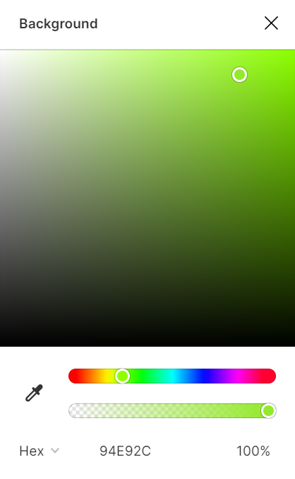

# CSS

## Sommaire

- [CSS](#css)
	- [Sommaire](#sommaire)
	- [Introduction](#introduction)
	- [Lier CSS à HTML](#lier-css-à-html)
	- [La syntaxe CSS](#la-syntaxe-css)
		- [Le sélecteur](#le-sélecteur)
		- [Le bloc de déclarations](#le-bloc-de-déclarations)
		- [Les propriétés](#les-propriétés)
		- [Un exemple](#un-exemple)
	- [Cibler un élément](#cibler-un-élément)
		- [Sélection globale](#sélection-globale)
		- [Sélectionner un seul élément: cibler un ID](#sélectionner-un-seul-élément-cibler-un-id)
		- [Appliquer un style à plusieurs éléments: cibler une classe](#appliquer-un-style-à-plusieurs-éléments-cibler-une-classe)
		- [Séléctions avancées](#séléctions-avancées)
			- [Sélections multiples](#sélections-multiples)
			- [Selectionner un enfant](#selectionner-un-enfant)
	- [Valeurs CSS](#valeurs-css)
		- [Couleurs](#couleurs)
			- [Par nom](#par-nom)
			- [RGB](#rgb)
			- [RGBA](#rgba)
			- [Code HEX](#code-hex)
		- [Tailles & unités](#tailles--unités)
			- [px : le pixel](#px--le-pixel)
			- [% : le pourcentage](#--le-pourcentage)
			- [vh et vw : Pourcentages de la taille d'écran](#vh-et-vw--pourcentages-de-la-taille-décran)
			- [Autres unités](#autres-unités)
	- [Changer l'apparence d'un élément](#changer-lapparence-dun-élément)
		- [Changer les couleurs](#changer-les-couleurs)
			- [Couleur de texte](#couleur-de-texte)
			- [Arrière-plan](#arrière-plan)
				- [Couleur unie](#couleur-unie)
				- [Image](#image)
				- [Dégradé](#dégradé)
		- [Polices](#polices)
			- [Importer une police](#importer-une-police)
			- [Utilisation](#utilisation)
			- [Taille et graisse](#taille-et-graisse)
	- [Disposition](#disposition)
		- [Inline / Block: la différence](#inline--block-la-différence)
			- [Inline](#inline)
			- [Block](#block)
		- [Le Box Model](#le-box-model)
			- [Les Marges extérieures: les margins](#les-marges-extérieures-les-margins)
			- [Les bords](#les-bords)
			- [Les marges intérieures: le padding](#les-marges-intérieures-le-padding)
		- [Layouts avancés](#layouts-avancés)
			- [Flexbox](#flexbox)
			- [Grid](#grid)

## Introduction

Nous avons vu le fonctionnement d'HTML, le contenu d'une page web. Il est maintenant temps de passer à CSS: le langage informatique utilisé pour styliser notre contenu!

CSS (Cascading Style Sheets) est un *langage déclaratif* (donc pas de logique). On y cible des éléments HTML pour changer leur apparence et/ou leur disposition.

## Lier CSS à HTML

Avant d'écrire dans notre fichier CSS, nous devons le lier à HTML, afin que nos changements prennent effet.

L'importation de notre fichier CSS se fait dans notre fichier HTML.

Pour ce faire, nous devons simplement relier les deux à l'aide d'un tag `<link />`, à placer dans le `<head>` de notre fichier, au dessus du tag `<title>`.

```
<link rel="stylesheet" href="./style.css">
```

Notre `<head>` ressemblera donc à:

```
<head>
  <meta charset="UTF-8">
  <meta http-equiv="X-UA-Compatible" content="IE=edge">
  <meta name="viewport" content="width=device-width, initial-scale=1.0">

  <link rel="stylesheet" href="./style.css">
  <title>Document</title>
</head>
```

**Notre fichier CSS est maintenant lié à notre HTML !**

## La syntaxe CSS

On écrit un fichier CSS différemment d'un fichier HTML. 

La syntaxe s'articule autours de **règles**. Un règle est composée d'un **sélecteur** et d'un bloc de **déclarations**


### Le sélecteur

> Le selecteur est la partie de la règle qui dicte que élément elle ciblera.

Il existe plusieurs façons d'écrire un sélecteur, et donc plusieurs façons de cibler un (ou plusieurs) éléments avec une règle. Nous les verrons en détail plus bas.

### Le bloc de déclarations

> Le bloc de déclarations est une liste paires propriété/valeurs.

On inclut dans le bloc de déclarations les **propriétés** que l'on souhaite appliquer à l'élément ciblé par le **sélecteur**.

### Les propriétés

> Une propriété CSS permet de changer un aspect du style de l'élément ciblé.

On assigne une valeur à la propriété CSS afin de changer le style d'un élément.

Par exemple, pour changer la couleur d'arrière plan d'un élément, on écrira:

```
  background-color: blue;
```

Il existe une multitude de propriétés CSS, toutes aussi utiles les unes que les autres. Nous verrons les plus communes au cours de cette leçon.

*[Voir la liste complète de toutes les propritétés CSS](https://www.w3schools.com/cssref/)*

### Un exemple

Nous voulons que tous les paragraphes présents sur notre page web soient rouges et alignés au centre. Pour ce faire, nous écrirons:

```
p {
  color: red;
  text-align: center;
}
```

*Ici, on cible le tag `p` et on leur assigne deux propriétés: `color` et `text-align`, ajustant réspectivement la couleur et l'alignement de nos paragraphes.*

## Cibler un élément

CSS propose plusieurs façons de selectionner un ou plusieurs éléments à la fois.

*Nous utiliserons dans les exemples ci-dessous le même bloc de déclarations, **seul le sélécteur changera**.* 

### Sélection globale

CSS permet de sélectionner **tous les éléments ayant le même tag**.

Pour sélectionner toutes les sections, on écrira:

*HTML*
```
<section >
	...
</section>

<main>
	<section>
		...
	</section>
</main>
```

*CSS*
```
section {
  margin-top: 20px;
  text-align: center;
}
```

> Ici, la règle sera appliquée aux deux éléments `<section>`, et à tous les autres dans le fichier HTML.

### Sélectionner un seul élément: cibler un ID

Afin de sélectionner un seul élément dans notre page, **on séléctionnera directement son ID**.

*HTML*
```
<p id="pagagraphe-gauche" > Lorem Ipsum </p>
```

*CSS*
```
#paragraphe-gauche {
  margin-top: 20px;
  text-align: center;
}
```

> Afin de sélectionner un élément par son ID, on précède ce dernier d'un **#**. Ainsi, on cible d'ID `paragraphe-gauche` avec le sélecteur `#paragraphe-gauche`.

### Appliquer un style à plusieurs éléments: cibler une classe

Nous pouvons tout autant écrire **une règle s'appliquant à plusieurs éléments à la fois**. Cette fonctionnalité est très utile lorsque notre contenu contient des éléments répétés, tels des liens dans la barre de navigation.

*HTML*
```
<nav >
	<a href="/" class="nav-link"> Home </a>
	<a href="/about" class="nav-link"> About </a>
	<a href="/work" class="nav-link"> Work </a>
	<a href="/contact"> Contact </a>
</nav>
```

*CSS*
```
.nav-link {
  margin-top: 20px;
  text-align: center;
}
```

> Ici, tous les liens `<a>` avec la classe `nav-link` seront ciblés par la règle CSS. Le dernier lien de contact restera inchangé.

### Séléctions avancées

Nous avons vu comment cibler un oou plusieurs éléments similaires grâce à leur ID, classe ou tag. Il existe néanmoins d'autre façons de cibler des éléments avec CSS.

#### Sélections multiples

**Une règle CSS peut avoir plusieurs sélécteurs !**

En séparant nos sélécteurs par une virgule (`,`), on peut cibler deux éléments ou plus avec une seule règle.

```

<h1> Je suis un grand titre </h1>

<h2> Je suis un sous-titre </h2>

```

*CSS*
```
h1, h2 {
  margin-top: 20px;
  text-align: center;
}
```

> On applique a titre `<h1>` et au sous-titre `<h2>` la même marge supérieure de 20 pixels et on les aligne au centre.

#### Selectionner un enfant

Il y a des situations où l'on souhaite **appliquer un style à un élément seulement lorsqu'il se trouve dans un autre élément**. CSS fournit un moyen de cibler les éléments se trouvant dans un élément parent.

```

<p> Le panda roux est un animal tout doux </p>

<section class="présentation">
	<p>
		Le panda roux est originaire de l'Himalaya et du Sud-Ouest de la Chine et préfère vivre dans les forêts montagneuses mixtes tempérées de la région, riches en bambou.
	</p>
</section>

```

*CSS*
```
#présentation p {
  margin-top: 20px;
  text-align: center;
}
```

> Seul le paragraphe `<p>` situé dans la section `#présentation` verra son style affecté par la règle.


## Valeurs CSS

Selon la propriété que l'on veut appliquer à un élément, sa valeur peut prendre plusieurs formes, plusieurs syntaxes.

### Couleurs

Il existe 4 façons d'écrire une couleur dans CSS, voyons en quoi elles consistent.

```
p {
	color: GreenYellow;
	color: rgb(148, 233, 44);
	color: rgba(148, 233, 44, 1);
	color: #94e92c;
}
```

*4 façons de changer en vert citron la couleur de tous les paragraphes.*

#### Par nom

Il est possible de sélectionner une couleur par son nom. Ainsi, CSS comprendra des mots anglais tels que `red`, `white`, `blue`, `majenta` ou `cyan`.

```
color: GreenYellow;
```

Cette méthodes est pratique mais limitée. Elle permet de rapidement colorer nos éléments, mais manque de souplesse: on est contraint d'utiliser les couleurs par défaut de CSS.

[Liste des couleurs par défaut](https://www.w3schools.com/cssref/css_colors.asp)

#### RGB

Pour plus de précision, on peut entrer directement les valeurs de **rouge, vert et bleu** qui composent la couleur que l'on veut appliquer.

Chaque valeur est un nombre **entre 0 et 255**. Plus le nombre est petit, plus la valeur est faible.

*Noir correspond à `rgb(0, 0, 0)`, blanc à `rgb(255, 255, 255)`.*

Ainsi, pour appliquer la couleur vert citron en RGB, on écrira:

```
color: rgb(146, 233, 43);
```

[Démo sur l'utilisation de la méthode RGB](https://codepen.io/blksnk/pen/ZEKPMXe?editors=1111)

#### RGBA

La méthode RGBA est très similaire à la méthode RGB, mais ajoute une valeur à notre code: **l'opacité**.

Comme pour RGB, les trois premiers chiffres vont de 0 à 255, mais **le dernier, qui contrôle l'opacité, va de 0 à 1**.

Ansi, pour appliquer notre couleur vert citron à 50% d'opacité, on écrira:

```
color: rgba(146, 233, 43, 0.5);
```

#### Code HEX

La notation en code HEX (pour héxadécimal) est une traduction de celle en RGB. Les nombres de 0 à 255 deviennent des caractères de **00 à FF**.

En règle générale, nous n'aurons pas à écrire nos couleurs en HEX. Les programmes de design tels que Figma nous génèrerons ces codes, et nous n'aurons plus qu'à les copier/coller dans notre fichier CSS.



Pour appliquer notre couleur vert citron sous format HEX, on écrira:

```
color: #94e92c;
```

> Attention, penser à bien placer le `#` avant notre code HEX, c'est ce qui indique à CSS que nous voulons utiliser une couleur dans ce format.

### Tailles & unités

CSS propose plusieurs façons d'exprimer des longueurs, qu'on appelle des unités (à la manière des mètres/centimères). Nous allons nous focaliser sur les plus utiles et utilisées.

#### px : le pixel

Le pixel est l'unité la plus utilisée par les designers et les développeurs. Comme son nom l'indique, elle permet de dimensionner les éléments au pixel près.

Ainsi, pour donner une largeur de 100 pixels à un élément, on écrira:

```
width: 100px;
```

> Attention, la taille d'un pixel change d'un écran à un autre. En effet, 1 pixel sur un téléphone ne sera pas de la même taille qu'1 pixel sur un écran 13 pouces.

#### % : le pourcentage

Le pourcentage permet de dimensionner un élément **en fonction de la taille de son parent**.

*HTML*
```
<main id="parent">
	<section id="enfant">
		...
	</section>
</main>
```

*CSS*
```
#parent {
	width: 100px;
}

#enfant {
	width: 50%;
}
```

> Ici, l'`#enfant` aura 50% de la largeur de son `#parent`, et fera donc **50px** de large. 


#### vh et vw : Pourcentages de la taille d'écran

Il arrive qu'un élément doivent prendre une partie ou toute la taille de l'écran. Pour cela, nous utiliserons les unités `vh` (*viewport height*) et `vw` (*viewport width*), respectivement les pourcentage de la hauteur et de la largeur de l'écran.

*HTML*
```
<section id="full">
	...
</section>
<section id="half">
	...
</section>
```

*CSS*
```
#full {
	height: 100vh;
	width: 100vw;
}

#half {
	height: 100vh;
	width: 50vw;
}
```

#### Autres unités

D'autres unités de longueur existent, mais ne sont utilisées que dans des cas très particuliers. En général, les unités ci-dessous suffiront à accomplir la plupart des tâches.

[Liste complète des unités CSS](https://developer.mozilla.org/en-US/docs/Learn/CSS/Building_blocks/Values_and_units)


## Changer l'apparence d'un élément

Notre fichier CSS sert à définir l'apparence, *le style* de nos éléments HTML. Chaque **propriété** peut en changer un aspect. Voici les plus utilisées.

### Changer les couleurs

#### Couleur de texte

La propriété `color` permet de changer la couleur du texte contenu dans nos éléments HTML. Elle prend pour valeur un couleur ([c.f. syntaxe des couleurs](#couleurs)).

Pour changer la couleur d'un paragraphe, on écrira:

```
p {
	color: rgba(190, 190 , 210);
}
```

#### Arrière-plan

Nous serons parfois amenés à changer l'arrière-plan d'un élément (ex: la barre de navigation de Facebook est bleue).

CSS met à notre disposition plusieurs options, toutes accessibles grâce à la propriété `background`. Il est néanmoins possible de définir directement la nature de l'arrière-plan en utilisant une propriété plus spécifique.

##### Couleur unie

Afin d'employer une couleur unie, nous utiliserons la propriété `background-color`.

Ainsi, on écrira: 

```
.card {
	background-color: blue;
}
```

##### Image

Il est possible d'utiliser une image comme arrière-plan d'un élément. Nous emploierons la propriété `background-image`, avec comme valeur le lien vers l'image.',

```
.card {
	background-image: url('https://i.pinimg.com/originals/9e/e2/b4/9ee2b4b4b2df0b00773f83923bcf3bad.jpg');
}
```

> Attention, lorsque l'on veut utiliser tout média (image, video, police) venu d'internet, on doit entourer le lien vers le média d'une balise `url()`.

##### Dégradé

CSS prend aussi en charge les dégradés !

Il nous suffit d'utiliser la propriété `background-image` suivie de la valeur `linear-gradient()`.

Un dégradé n'est rien sans les couleurs qui le composent. Pour les définir, on écrit nos couleurs entre les parenthèses, séparées d'une virgule (`,`):

```
.card {
	background-image: linear-gradient(#0021FF, purple);
}
```

Il est aussi possible de définir la direction d'un dégradé, en spécifiant `to`, suivi des mots-clés `top`, `bottom`, `left` ou `right`.

```
.card {
	background-image: linear-gradient(to top right, #0021FF, purple, rgba(245, 05, 25, 1));
}
```

[Voir la démo]()


### Polices

La police par défaut d'HTML (Times New Roman) est franchement laide. Il est heureusement possible d'importer de nouvelles polices afin de les utiliser dans notre page.

Trouver et importer des polices facilement: [Google Fonts](https://fonts.google.com)

#### Importer une police

Une fois la police de nos rêves trouvée, il est temps de l'importer dans notre fichier CSS.

Pour ce faire, on écrit la ligne suivante tout en haut de notre fichier CSS:

```
@import url('https://fonts.googleapis.com/css2?family=Abril+Fatface&display=swap');
```

> Ici encore, on utilise `url()` pour importer un média venu d'internet.

La plupart du temps, Google Fonts (ou toute autre plateforme de polices en ligne) génère automatiquement le lien vers notre séléction de polices. Nous n'avons alors plus qu'a copier/coller le code généré dans notre fichier CSS.

#### Utilisation

Une fois notre police importée, nous utiliserons la propriété `font-family` pour l'appliquer à l'élément de notre choix.

Ainsi, pour qu'un titre utilise la police *Abril Fatface*, on écrira:

```
@import url('https://fonts.googleapis.com/css2?family=Abril+Fatface&display=swap');

h1 {
	font-family: 'Abril Fatface'
}
```

#### Taille et graisse

La taille du texte de notre élément est définie par la propriété `font-size`, sa graisse (= son épaisseur) par `font-weight` et son style (italique ou non).

`font-size` prend comme valeur une unité de longueur (`px`, `%`, `vh`, `vw`, etc...). En règle générale, on dicte la taille de police en `px`.

`font-weight` dicte la graisse de la police. Cette propriété prend comme valeur soit `normal`, soit `bold`. Pour les polices variables, un nombre entre 100 et 900 peut être renseigné afin d'avoir plus de précision.


*HTML*
```
<h1> Titre </h1>
```

*CSS*
```
h1 {
	font-size: 64px;

	font-weight: bold;
	font-weight: 700;
}
```

## Disposition

Changer la disposition de nos éléments HTML est possible grâce à CSS, et ce de bien des façons. Avant de toucher à cela, il nous faut comprendre quelques concepts de base.

### Inline / Block: la différence

Au fil des expérimentations, nous nous rendrons compte que certains éléments HTML se placent sur une nouvelle ligne, tandis que d'autres viennent se placer sur la même ligne que l'élement le précédant.

Il nous est possible de changer cette disposition à l'aide de la propriété `display`.

#### Inline

**On appelle `inline` les éléments qui viennent se placer sur la même ligne que les précédents.**

Par exemple, les liens `<a>`, boutons `<button>` et les tags de style `<em>` et `<strong>` sont par défaut en `inline`.

Pour forcer un élément à se placer sur la même ligne que celui qui le précède, on écrira:

```
#cible {
	display: inline;
}
```

#### Block

**Les éléments venant se placer sur une nouvelle ligne par défaut sont disposés en `block`.**

On y compte la majorité des éléments conteneurs tels que `<main>`, `<section>` ou `<div>`, ainsi que les titres `<h1>` à `<h6>`.

Pour forcer un élément à se placer sur une nouvelle ligne, on écrira:

```
#cible {
	display: block;
}
```

### Le Box Model


#### Les Marges extérieures: les margins

#### Les bords

#### Les marges intérieures: le padding

### Layouts avancés

#### Flexbox

#### Grid
